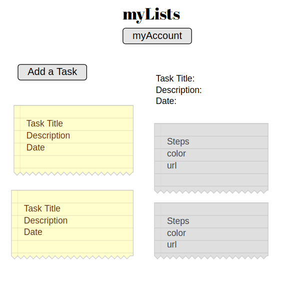

Initial ReadMe File for Front End.
<!-- Pin your repository on GitHub as a Popular Repository
Complete the repository Description field and Website field with a meaningful sentence description of the application and link to the live URL github image
List technologies used
Document your planning and tell a story about your development process and problem-solving strategy.
List unsolved problems which would be fixed in future iterations.
Link to wireframes and user stories. -->
Front-end Github Repo: https://github.com/selcuktoklucu/my-job-list-front-end
Back-End Github Repo: https://github.com/selcuktoklucu/my-job-list-back-end

Live URL: https://selcuktoklucu.github.io/my-job-list-front-end/
Back-end URL: https://mylistss.herokuapp.com/

This is a simply designed task tracker application, uses powerful user tracking system with connecting to specifically designed API server..
System provides these features:
-User security
-Keep tracks of user's tasks
-Keep tracks of steps of these tasks
-Creating,Updating,Reading,Deleting these resources on the API server, associated with the user.

Unsolved Problems: Visual design is improvable. Limitation for each user's tasks and steps can be added. Footer has a problem, blocks content.

Tech Keywords: Single-Page-Application(SPA), Ruby on Rails, PostgreSQL, HTML5,Javascript, Bootstrap 3, CSS3, API, JSON, JQuery, Git/Github, Authentication, Full-Stack, Database, RDMS

Some user stories from my users!
1) As a busy person, I wish I could save my daily tasks somewhere besides google or any other application
2) As a person, It would be nice to have a cloud environment to keep my things in it.
3) Lists are my life! Something, usable and able to put my scheduled tasks. Wish to have notification!

Wireframes

